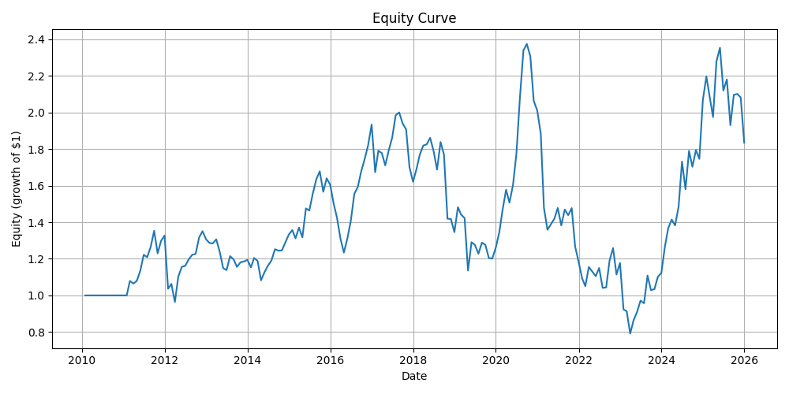
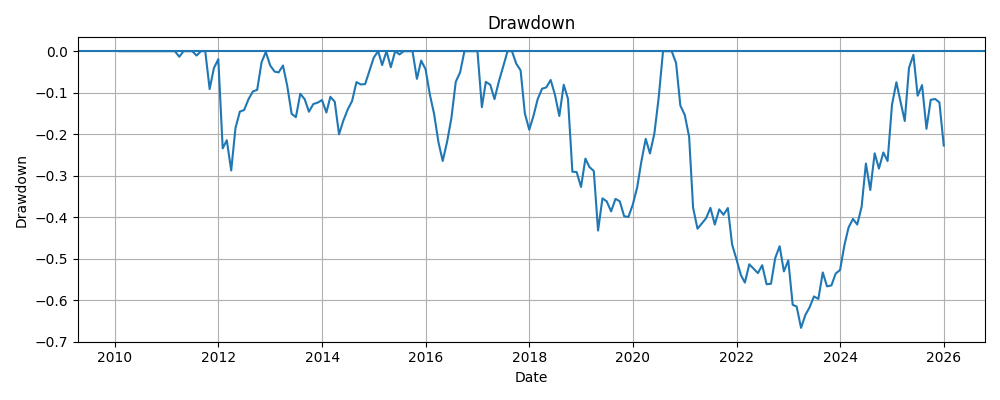
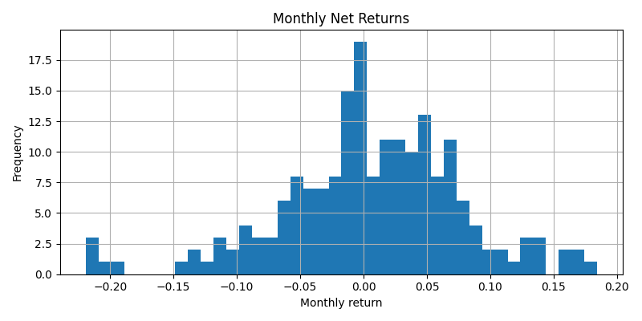
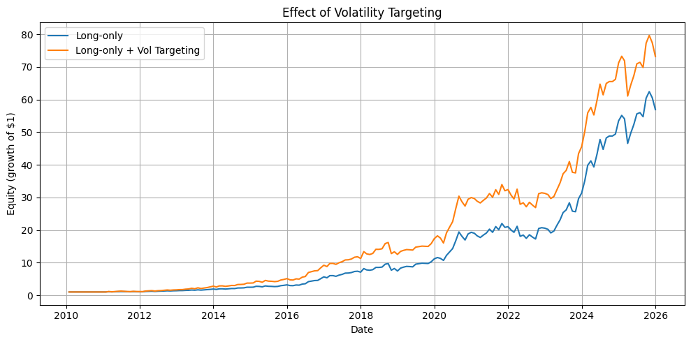

# Cross-Sectional Momentum (Long-Only) with Volatility Targeting

This repository contains a small end-to-end quant research project that builds a **long-only cross-sectional momentum** equity strategy and improves it using **volatility targeting**.

The goal is to demonstrate a clean and correct research workflow:
data → signal → portfolio construction → backtest → diagnostics → risk control.

---

## Strategy overview

Each month:

1. Compute a **12–1 momentum signal** for each stock  
   (past 12 months of returns, skipping the most recent month).
2. Rank stocks by this signal.
3. Go **long-only** the top 10% of stocks, equally weighted.
4. Apply **volatility targeting** to scale exposure based on recent realized volatility.

Volatility targeting changes **how much capital is allocated**, not **which stocks are selected**.

---

## Repository structure
```text
├── src/ # Core research logic (signals, backtest, metrics, plots)
├── scripts/
│ └── run_backtest.py # End-to-end backtest runner
├── notebooks/ # Exploration and sanity checks
├── data/
│ ├── raw/
│ ├── processed/
│ └── outputs/ # Results and figures
├── reports/ # report.md
├── README.md
└── requirements.txt
```
---

## Quickstart

### Install dependencies

```bash
pip install -r requirements.txt
```

### Run the backtest

From the repository root:
```bash
python -m scripts.run_backtest
```

## Outputs

Saved files:
```bash
data/outputs/results.csv
data/outputs/Figure_1_Equity_Curve.png
data/outputs/Figure_2_Drawdowns.png
data/outputs/Figure_3_Histogram.png
data/outputs/Figure_4_Volatility_Targeting.png
```

## Results
### Long-only momentum equity curve
Growth of $1 invested in the baseline long-only momentum strategy.


### Drawdowns
Maximum losses from previous equity peaks



### Monthly return distribution
Histogram of monthly net returns


### Effect of volatility targeting
Baseline vs volatility-targeted strategy.


---

## Methodology
### Momentum signal (12–1)

Definition:
```bash
Momentum_12-1(t) = P(t-1) / P(t-12) - 1
```

- Uses month-end adjusted prices
- Excludes the most recent month to reduce short-term noise

### Backtest design

- Monthly rebalancing
- Equal-weighted positions among selected stocks
- No look-ahead bias: weights at month t are applied to returns in month t+1

### Volatility targeting

- Estimate recent strategy volatility using a rolling window of past strategy returns
- Scale total exposure toward a fixed target volatility
- Apply a leverage cap to avoid extreme exposure

This stabilizes risk without changing stock selection.

---

## Limitations

- Yahoo Finance data is used for learning (not institutional-grade)
- The fixed universe may include survivorship bias
- Results are intended to demonstrate correct methodology, not production performance

---

## Possible extensions

- Larger / cleaner datasets and broader universes
- Sector-neutral portfolio construction
- Market regime filters
- Machine learning ranking models (built on top of this baseline)